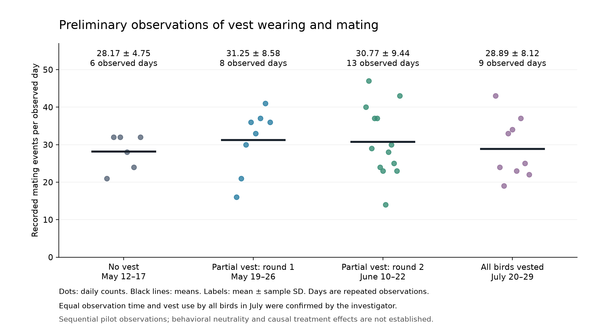

# Preliminary observations of vest wearing and mating

We recorded mating counts across sequential observation periods with different
vest-wearing conditions. Observation time was the same across periods. The results
provide a preliminary descriptive assessment and do not establish that vests have
no effect on mating behavior.

## Observation design

The daily records describe an initial flock of eight roosters and 80 hens, followed
by subdivision into groups of four roosters and 40 hens. The comparison below starts
with the post-subdivision no-vest period. In the first partial-vest round, half of
the roosters and half of the hens wore vests. Vest assignment was subsequently
switched to the other birds. In July, all birds, including all roosters, wore vests.
Equal observation time and the July treatment were confirmed by the investigator.

## Daily mating counts

Each dot represents one observed day's flock-level mating count; black lines show
the means. Labels report the mean and sample standard deviation (SD) across days.
Counts are not per-bird rates, and the number of days is not the number of
independent experimental replicates.

| Condition | Observation window | Observed days | Total events | Mean ± sample SD, events/observed day |
|---|---|---:|---:|---:|
| No vest | May 12–17 | 6 | 169 | 28.17 ± 4.75 |
| Partial vest: round 1 | May 19–26 | 8 | 250 | 31.25 ± 8.58 |
| Partial vest: round 2 | June 10–22 | 13 | 400 | 30.77 ± 9.44 |
| All birds vested | July 20–29 | 9 | 260 | 28.89 ± 8.12 |

The recorded daily means during vest-wearing periods were close to, and did not
fall below, the no-vest period mean. However, conditions were observed sequentially,
so these counts cannot separate vest effects from period effects or individual
differences. Similar flock-level means also do not exclude changes in the behavior
of individual birds.

## Mating combinations during partial vest wearing

Percentages describe the composition of recorded mating events, not mate preference
or an individual bird's probability of mating.

| Rooster / hen status | Round 1 (250 events) | Round 2 (400 events) | Pooled (650 events) |
|---|---:|---:|---:|
| Vested / vested | 20 (8.0%) | 86 (21.5%) | 106 (16.3%) |
| Vested / unvested | 46 (18.4%) | 107 (26.8%) | 153 (23.5%) |
| Unvested / vested | 65 (26.0%) | 104 (26.0%) | 169 (26.0%) |
| Unvested / unvested | 119 (47.6%) | 103 (25.8%) | 222 (34.2%) |

Both-unvested pairings accounted for 47.6% of events in round 1 and 25.8% in round 2.
The more balanced distribution after switching vest assignment does not by itself
demonstrate habituation: different individual birds wore vests in the two rounds,
and the observation periods also differed.

## Data and calculation notes

- [Daily counts and mating combinations (CSV)](daily_counts.csv)
- [Figure in vector format (SVG)](vest_pilot_daily_counts.svg)

The analysis includes 36 observed days across four observation periods. Counts are
summarized as the daily mean ± sample SD (denominator n−1). Mating-combination
percentages use the total recorded events in each period; pooled percentages use
the combined event counts. Blank combination values indicate an unavailable
breakdown, not zero events.

The May 8–11 period is excluded because flock size differed (eight roosters and
80 hens). May 18, the initial vest operation day, is also excluded from the main
comparison. This day had 30 events; including it in round 1 gives 31.11 events/day
over nine days, compared with 31.25 over the eight days shown. This exclusion was
not documented as prespecified.

July 28 lacks a daily total and is excluded; missing observations are not treated
as zero. Summaries use the daily totals consistently. Separate individual-event
records do not fully reconcile with those totals and were not used to fill gaps.
Dates are shown as month and day because the year of the full observation series
remains unverified.

## Interpretation and further work

These preliminary data describe repeated daily observations under sequential
vest-wearing conditions with equal observation time. They do not establish a causal
vest effect: independent pen replication and randomized allocation have not been
documented, and no significance or equivalence test is presented.

Further controlled experiments with replicated pens, documented allocation,
standardized observation and scoring protocols, and individual-level records are
needed. The current results do not establish behavioral neutrality, habituation,
or equivalence between vested and unvested birds.
